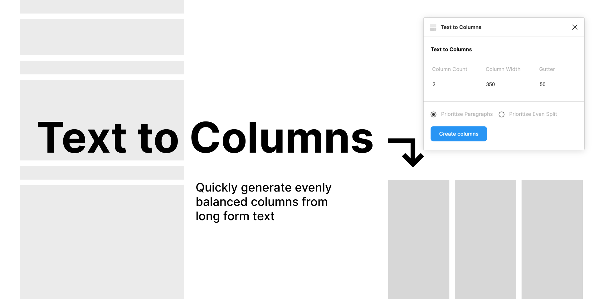

# Text to Columns

## Generate evenly balanced columns from long form text.

### ✨ To Use
- Run the plugin
- Select an element containing text
- Update settings if required
- Click 'Create columns'

### ✨ Notes
- This plugin will work on any text element
- Columns are created without splitting words
- If only one text style is used it will be used in the newly created columns. Due to Figma's api, if multiple text styles are used in the reference element, the default font style (Roboto) will be used in the new columns instead.
- Due to the way Figma returns text strings, soft returns (` `) are ignored. Unfortunately I'm not sure if there is a fix for this until they update the api.
- The Prioritise Paragraphs option ensures paragraphs are not split
- The Prioritise Even Split option ensures each column has an even amount of words (the end result will likely need some manual finessing depending on your design)

### ❌ If you encounter any errors ❌ 
- Any time the plugin does not work, the cause is most likely due to invisible/zero width characters in your text element (this happens if you work between Mac and PC for example)
- To check if this is the case, you can open up the console by clicking Plugins > Development > Open console. Copy and paste the text string in the console log to <https://regex101.com/>. If there are any weird characters in there you'll see them highlighted.
- If this happens to you please submit an issue on Github so I can fix it in the regex! Thank you.

---
♡ If you run into any bugs or have feature requests please submit an issue.

