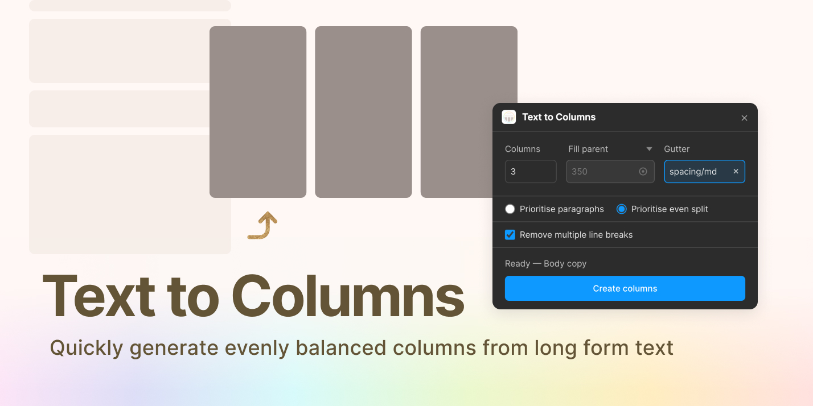

# Text to Columns


Generate evenly balanced columns from long form text - with your fonts, colours, links and lists kept intact.

---

### How to use
1. Select one or more text layers.
2. Run the plugin and set your options.
3. Click **Create columns**.

---

### Two ways to split
- **Prioritise Paragraphs** — columns only break between paragraphs, so a paragraph is never split in two
- **Prioritise Even Split** — columns break between words, so every column holds a similar amount of text

### Variables
Pick a number variable instead of manually typing a number. Click the × to go back to typing a number. Only local variables are listed.

### Reflow the columns
Select columns you've already made, change the count, width or gutter and the same frame is rebuilt in place.

### Quick apply
Open the quick actions bar (`⌘/` or `Ctrl /`), type Text to Columns, then enter a column count. Width and gutter are optional.

---

### Notes
- Works in Figma Design, FigJam, Slides and Buzz.
- Fonts, sizes, colours, styles, links, lists and indents are kept.
- Columns are split by the amount of text, so you may still need to adjust manually if prioritising an even split.
- If there isn't enough text, you get fewer columns and a message.
- Missing fonts must be addressed first.

### Privacy
The plugin works offline. It sends nothing anywhere and has no tracking.

It stores two things with Figma's plugin API:
- **On the frame:** your settings, any variable ids, and the blank space between columns. None of your words are stored.
- **On your computer:** your settings, so the plugin opens as you last used it.

---

♥️ If you have any feedback or suggestions please leave a comment or email me at jaclyntan02@gmail.com. The plugin shows a message when something goes wrong. If it doesn't explain the problem, [open an issue](https://github.com/jaclyntan/figma-text-to-columns/issues) and include the text you were splitting.

### Development
```sh
npm install
npm run build     # compiles code.ts -> code.js
npm run watch     # rebuild on change
npm run typecheck # type check without emitting
npm test          # build, then run the splitting + column-building tests
```
In Figma, go to **Plugins → Development → Import plugin from manifest** and pick `manifest.json`.
